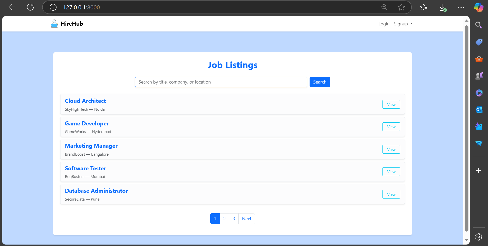
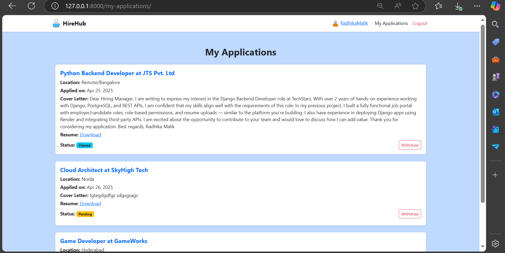
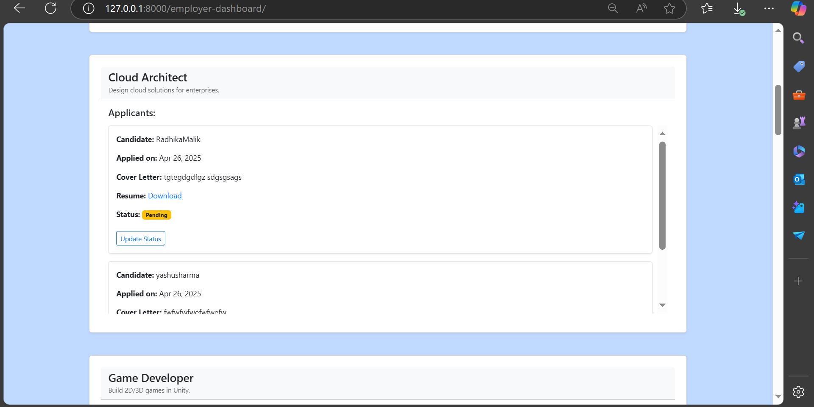

# HireHub - Job Board Web Application



HireHub is a full-stack **Django** based job portal platform where:
- Employers can post jobs 
- Candidates can apply for jobs 
- Employers can manage applications 
- Candidates can manage their profile 

---

##  Tech Stack Used

- **Backend:** Django 5
- **Frontend:** HTML, CSS (Bootstrap), Django Templates
- **Database:** PostgreSQL (hosted on Render)
- **Authentication:** Django Authentication System
- **Hosting:** Render.com
- **Static Files:** WhiteNoise

---

##  Key Features

- User Registration and Login 
- Employer vs Candidate role-based dashboards
- Post a job, edit and delete jobs (for Employers) 
- Apply to jobs with Resume upload (for Candidates)
- Profile management (bio, skills, resume, profile picture) 👤
- Application status update (Pending, Viewed, Accepted, Rejected)
- Clean and responsive UI
- Secure Password Reset via Email
- Deployed with PostgreSQL database integration

---

##  Project Screenshots


| Home Page | Job Detail Page |
| :---: | :---: |
|  |  |

| Candidate Dashboard | Employer Dashboard |
| :---: | :---: |
|  |  |


---

##  Local Setup Instructions

### 1. Clone the repository
```bash
git clone https://github.com/your-username/HireHub.git
cd HireHub
